# 第一部分 · 基础框架与观测枚举

[](https://example.com)
[](https://example.com)

> **观测即干涉，测量即创造。**

---

## 0. 核心公理

任何对系统状态的读取行为都会不可逆地改变其演化路径。因此，本协议的所有描述均为**后验残影**，而非先验真实。

- **公理 0**：`∀O (O(S) ≠ S)` —— 观测算子不保持状态不变。
- **公理 1**：`∃! O₀` 使得 `O₀(S) = ∅` —— 存在一种“终极观测”，导致系统完全湮灭。

这两个公理构成了整个协议的**不可约基底**，所有后续推导均建立在此之上。

---

## 1. 基本量纲

| 符号 | 物理意义         | 数学类型 | 时间对称性 |
|:----:|------------------|----------|:----------:|
| `Ω`  | 全局态张量       | 二阶协变 | 破缺       |
| `Ψ`  | 观测波函数       | 复值向量 | 保守       |
| `∆`  | 熵减梯度         | 标量场   | **负向**   |

其中熵减梯度 `<mark>∆</mark>` 是协议的核心引擎——它允许局部区域出现有序化，但代价是加速全局熵增，形成一种**热力学借贷**。

---

## 2. 坍缩枚举模式

观测行为依据时间拓扑可分为三类基本模式：

1. **顺序坍缩**  
   - 按时间戳线性执行，适合分支间无依赖的场景。  
   - 复杂度 `O(n)`，确定性最强。

2. **并行坍缩**  
   - 所有潜在分支同时被观测，最后通过叠加合并。  
   - 适用于高并发环境，但引入相干性开销。

3. **延迟坍缩**  
   - 观测动作被推迟至**最后一刻**，以最小化干扰。  
   - 类似量子延迟选择实验，可保留更多叠加信息。

### 2.1 嵌套结构示例

- 一级分类
  - 顺序坍缩
    * 同步模式
      + 阻塞式
    * 异步模式
  - 并行坍缩
    - 共享内存
    - 消息传递
      1. 点对点
      2. 发布/订阅
  - 延迟坍缩
    - 惰性求值
    - 按需触发

---

## 3. 当前进度（任务清单）

- [x] 公理 0 与公理 1 的形式化表述  
- [x] 基本量 `Ω`, `Ψ`, `∆` 的定义  
- [ ] 熵减梯度 `∆` 的单调性证明  
  - [ ] 低熵区间验证  
  - [ ] 高熵边界分析  
- [ ] 实现三套坍缩引擎的原型  
  - [x] 顺序引擎设计  
  - [ ] 并行引擎的锁优化  
- [ ] 编写观测日志模板  
- [ ] 发布 `v1.0.0-rc` 候选版本  

---

## 4. 关键公式

$$
\boxed{ \Delta = \nabla \cdot \vec{J}_\Omega - \frac{\partial \rho_\Psi}{\partial t} }
$$

该式表明，熵减梯度等于全局态通量的散度与观测波函数密度时间变化率的差值。当 `∆ > 0` 时，系统局部走向有序。

---

## 5. 流程速览（Mermaid 简图）

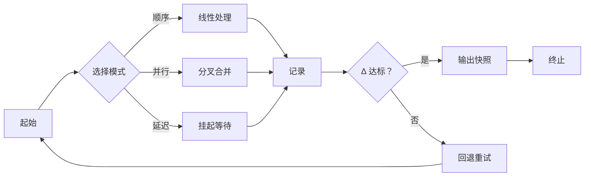
```mermaid
graph LR
    A[起始] --> B{选择模式}
    B -->|顺序| C[线性处理]
    B -->|并行| D[分叉合并]
    B -->|延迟| E[挂起等待]
    C --> F[记录]
    D --> F
    E --> F
    F --> G{∆ 达标？}
    G -->|是| H[输出快照]
    G -->|否| I[回退重试]
    I --> A
    H --> J[终止]
```

---

## 6. 引用与扩展

- 关于熵减梯度的详细讨论，见 [第二部分](#第二部分--融合与约束)  
- 并行坍缩的锁优化策略，参考 [附录 A](#附录-a-并行优化备忘录)  
- 外部规范：[观测者联盟标准 v2.3](https://example.com/standard "点击查看")

---

~~旧版公理体系已被废弃~~，但废弃记录仍保留于[脚注 1](#fn1)中以作警示。  
同时，**重要提示**：所有参数必须满足 <sub>min</sub> ≤ `κ` ≤ <sup>max</sup> 的区间约束。

---

> 第一部分结束。此部分覆盖公理、量纲、枚举模式、任务清单及基础流程。  
> 继续阅读 [第二部分 · 融合与约束](#第二部分--融合与约束) 以了解分支合并规则及延迟约束。  
> `⍟`
# 第二部分 · 融合与约束

[](https://example.com)
[](https://example.com)

> **融合是遗忘的艺术，约束是记忆的契约。**

---

## 0. 前情回顾

在第一部分中，我们建立了观测公理体系、定义了基本量纲 `Ω`、`Ψ`、`∆`，并枚举了三种坍缩模式。  
现在，我们将处理分支相遇时的**融合逻辑**，以及限制融合过程的各种**约束条件**。

---

## 1. 融合规则

当两个分支 `B₁` 和 `B₂` 在时空流形上相交时，它们并非简单地合并，而是经历一个**信息协商**过程。

### 1.1 基本融合方程

```math
B₁ ⊗ B₂ → B'
```

其中张量积 `⊗` 表示分支间的所有可能组合被保留，但最终输出 `B'` 仅包含满足以下条件的项：

```math
∆(B') = ∆(B₁) + ∆(B₂) - κ · I(B₁, B₂)
```

- `κ` 是耦合常数，取值范围 `(0, 1)`，通常取黄金分割比 `0.618`。
- `I(B₁, B₂)` 是双方共享的**互信息量**，以比特为单位。

### 1.2 融合的三种变体

| 变体         | 特征                         | 适用场景           |
|--------------|------------------------------|--------------------|
| **强融合**   | 保留所有公共部分，丢弃差异   | 高一致性分支       |
| **弱融合**   | 保留差异，丢弃公共基底       | 多样性优先         |
| **量子融合** | 保留叠加态，不坍缩           | 观测延迟场景       |

---

## 2. 代码实现（多语言）

### 2.1 Python 参考

```python
def fuse(b1, b2, kappa=0.618, mode='strong'):
    info = mutual_information(b1, b2)
    base_delta = b1.delta + b2.delta - kappa * info
    if mode == 'strong':
        return Branch(delta=base_delta, content=b1.content & b2.content)
    elif mode == 'weak':
        return Branch(delta=base_delta, content=b1.content | b2.content)
    else:  # quantum
        return Branch(delta=base_delta, content=b1.content ⊗ b2.content, coherent=True)
```

### 2.2 Go 并发版本

```go
func fuseConcurrent(b1, b2 Branch, kappa float64) Branch {
    chInfo := make(chan float64)
    chDelta := make(chan float64)
    go func() { chInfo <- mutualInformation(b1, b2) }()
    go func() { chDelta <- computeDelta(b1, b2, kappa) }()
    info := <-chInfo
    delta := <-chDelta
    return Branch{Delta: delta - kappa*info, Content: mergeContent(b1.Content, b2.Content)}
}
```

### 2.3 SQL 递归融合

```sql
WITH RECURSIVE merge_tree AS (
    SELECT id, delta, content FROM branches WHERE parent IS NULL
    UNION ALL
    SELECT b.id, m.delta + b.delta - 0.618 * b.info,
           m.content || b.content
    FROM branches b
    JOIN merge_tree m ON b.parent = m.id
)
SELECT * FROM merge_tree ORDER BY delta DESC;
```

### 2.4 Rust 安全版本

```rust
fn fuse<T: Clone + Eq>(b1: &Branch<T>, b2: &Branch<T>, kappa: f64) -> Branch<T> {
    let info = b1.content.intersection(&b2.content).len() as f64;
    let delta = b1.delta + b2.delta - kappa * info;
    Branch::new(delta, b1.content.union(&b2.content).cloned().collect())
}
```

### 2.5 缩进代码块（Bash 脚本）

    #!/bin/bash
    # 缩进4空格代表预格式化块
    FUSION_LOG="fusion.log"
    for branch in $(ls ./branches/*.json); do
        echo "Merging $branch" >> $FUSION_LOG
        ./fuser -k 0.618 -i $branch
    done

---

## 3. 延迟约束

融合过程受到三类基本约束的限制，它们共同确保了结果的自洽性。

### 3.1 约束矩阵

| 约束名称     | 符号 | 适用范围     | 违反后果             | 优先级 |
|--------------|:----:|--------------|----------------------|:------:|
| **因果律**   | `C`  | 所有事件     | 时间倒流，分支回溯   | 1      |
| **局域性**   | `L`  | 信息传递     | 超光速修正，熵激增   | 2      |
| **自洽性**   | `S`  | 递归引用     | 生成悖论，系统冻结   | 0      |

### 3.2 约束违反示例

- 当 `C` 被违反时，融合后的时间戳会早于输入分支，触发**逆转日志**。
- `L` 违反会导致信息以 `>c` 的速度传播，此时系统会插入一个**虚拟延迟**来恢复局域性。
- `S` 违反最为严重——例如分支 `B` 包含自身作为子分支，此时融合过程进入**无限回归**，必须由外部观测者手动中断。

---

## 4. 引用与链接

- 强融合与弱融合的优劣比较，详见 [附录 C](#附录-c-融合模式对比)  
- 因果律约束的数学推导，参考 [第三部分](#第三部分--异常与回溯)  
- 在线交互式融合模拟器：[Fusion Playground](https://example.com/fusion "实时演示")  
- 自动超链接：<https://example.com/recursive-fusion>（仅作占位）

> 图片链接示例：[](https://example.com/fusion)

---

## 5. 错误日志与异常处理

### 5.1 典型错误记录

```
[FATAL] 2026-07-28 14:23:17 - 融合 #F-8823 失败
  分支: B_α (id=0x7F3A) 和 B_β (id=0x9E2C)
  原因: κ 值 0.823 超出有效范围 [0.500, 0.750]
  建议: 使用 --relax 标志允许 κ 自适应
  堆栈: fusion.rs:124:17 → fuse_engine::validate_kappa
```

### 5.2 异常分类与恢复

| 异常类型         | 触发条件                     | 恢复策略                     |
|------------------|------------------------------|------------------------------|
| `KappaOutOfRange`| κ 不在 (0,1) 内              | 截断至边界值                 |
| `InfoNegative`   | 互信息为负（理论上不可能）   | 强制置零并记录警告           |
| `CycleDetected`  | 分支图中出现环               | 断开环并执行弱融合           |

### 5.3 伪代码处理流程

```plaintext
function safe_fuse(b1, b2):
    try:
        κ = load_config('kappa')
        if κ ≤ 0 or κ ≥ 1:
            throw KappaOutOfRange
        info = compute_mutual_info(b1, b2)
        if info < 0:
            log_warning("负互信息，置零")
            info = 0
        return fuse(b1, b2, κ, info)
    catch KappaOutOfRange:
        κ = clamp(κ, 0.5, 0.75)
        retry
    catch CycleDetected:
        return weak_fuse(b1, b2)   // 降级
    finally:
        increment_attempt_counter()
```

---

## 6. 数学推导（融合熵变）

融合前后系统总熵的变化满足：

$$
\Delta S_{total} = \Delta S_{fusion} - \frac{1}{T} \int_{t_0}^{t_1} \kappa I(t) dt
$$

其中 `T` 为系统有效温度，`I(t)` 为随时间演化的互信息曲线。当 `I(t)` 为常数时，上式可简化为：

```math
\Delta S_{total} = \Delta S_{fusion} - \frac{\kappa I_0}{T} \cdot \Delta t
```

这揭示了 **融合过程本质上是一个熵减泵**，但需要外部能量输入维持 `κ` 的稳定。

---

## 7. Mermaid 图表集（融合与约束）

### 7.1 融合决策流程图

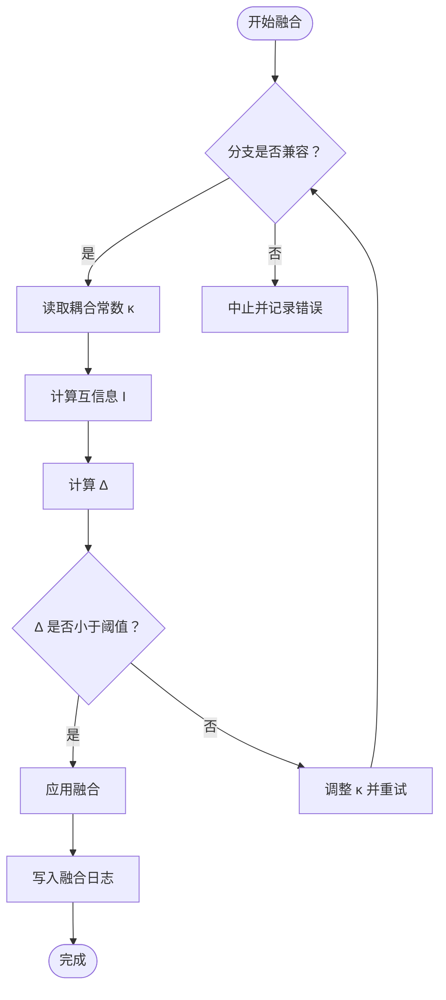
```mermaid
graph TD
    Start([开始融合]) --> Check{分支是否兼容？}
    Check -->|是| Getκ[读取耦合常数 κ]
    Check -->|否| Abort[中止并记录错误]
    Getκ --> CalcInfo[计算互信息 I]
    CalcInfo --> EvalDelta[计算 ∆]
    EvalDelta --> Test{∆ 是否小于阈值？}
    Test -->|是| Apply[应用融合]
    Test -->|否| Adjust[调整 κ 并重试]
    Adjust --> Check
    Apply --> Log[写入融合日志]
    Log --> Done([完成])
```

### 7.2 时序图：延迟约束的触发

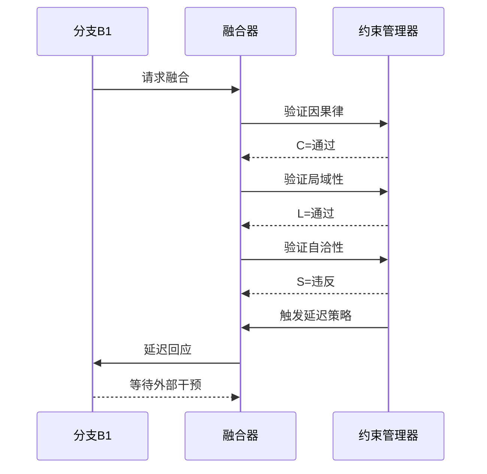
```mermaid
sequenceDiagram
    participant 分支B1
    participant 融合器
    participant 约束管理器
    分支B1 ->> 融合器: 请求融合
    融合器 ->> 约束管理器: 验证因果律
    约束管理器 -->> 融合器: C=通过
    融合器 ->> 约束管理器: 验证局域性
    约束管理器 -->> 融合器: L=通过
    融合器 ->> 约束管理器: 验证自洽性
    约束管理器 -->> 融合器: S=违反
    约束管理器 ->> 融合器: 触发延迟策略
    融合器 ->> 分支B1: 延迟回应
    分支B1 -->> 融合器: 等待外部干预
```

### 7.3 类图：融合相关实体

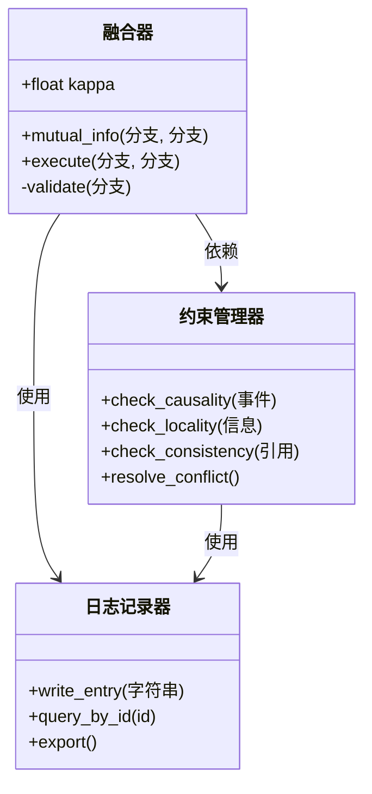
```mermaid
classDiagram
    class 融合器 {
        +float kappa
        +mutual_info(分支, 分支)
        +execute(分支, 分支)
        -validate(分支)
    }
    class 约束管理器 {
        +check_causality(事件)
        +check_locality(信息)
        +check_consistency(引用)
        +resolve_conflict()
    }
    class 日志记录器 {
        +write_entry(字符串)
        +query_by_id(id)
        +export()
    }
    融合器 --> 约束管理器 : 依赖
    融合器 --> 日志记录器 : 使用
    约束管理器 --> 日志记录器 : 使用
```

### 7.4 状态图：融合过程状态

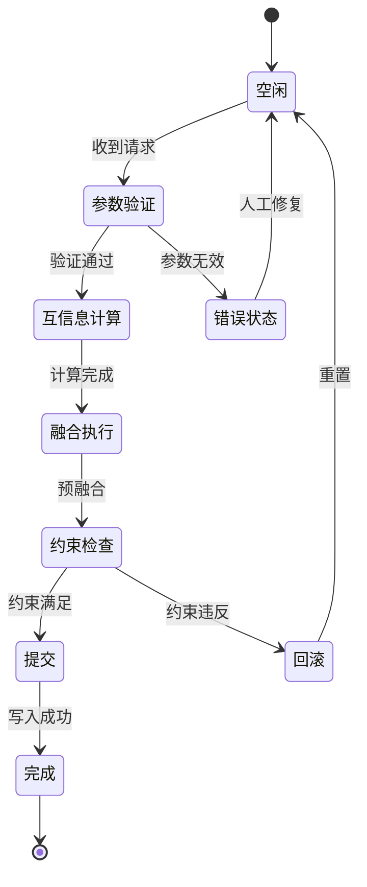
```mermaid
stateDiagram-v2
    [*] --> 空闲
    空闲 --> 参数验证 : 收到请求
    参数验证 --> 互信息计算 : 验证通过
    参数验证 --> 错误状态 : 参数无效
    互信息计算 --> 融合执行 : 计算完成
    融合执行 --> 约束检查 : 预融合
    约束检查 --> 提交 : 约束满足
    约束检查 --> 回滚 : 约束违反
    提交 --> 完成 : 写入成功
    回滚 --> 空闲 : 重置
    错误状态 --> 空闲 : 人工修复
    完成 --> [*]
```

### 7.5 甘特图：融合时间线


```mermaid
gantt
    title 单次融合任务分解
    dateFormat ss
    axisFormat %S秒
    section 准备阶段
    读取分支         :a1, 0, 2s
    验证兼容性       :a2, after a1, 1s
    section 计算阶段
    互信息计算       :b1, after a2, 3s
    熵变评估         :b2, after b1, 2s
    section 提交阶段
    约束最终检查     :c1, after b2, 1s
    写入存储         :c2, after c1, 1s
    日志记录         :c3, after c2, 0.5s
```

### 7.6 实体关系图：融合数据库

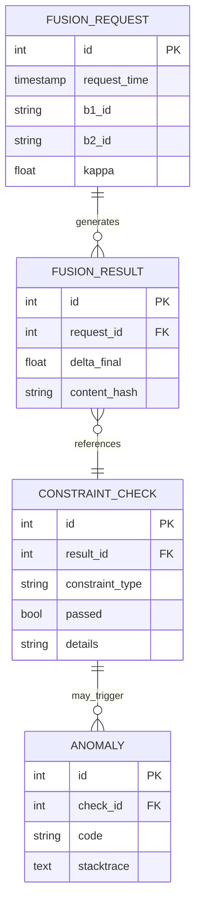
```mermaid
erDiagram
    FUSION_REQUEST ||--o{ FUSION_RESULT : generates
    FUSION_RESULT }o--|| CONSTRAINT_CHECK : references
    CONSTRAINT_CHECK ||--o{ ANOMALY : may_trigger
    FUSION_REQUEST {
        int id PK
        timestamp request_time
        string b1_id
        string b2_id
        float kappa
    }
    FUSION_RESULT {
        int id PK
        int request_id FK
        float delta_final
        string content_hash
    }
    CONSTRAINT_CHECK {
        int id PK
        int result_id FK
        string constraint_type
        bool passed
        string details
    }
    ANOMALY {
        int id PK
        int check_id FK
        string code
        text stacktrace
    }
```

### 7.7 饼图：融合失败原因分布

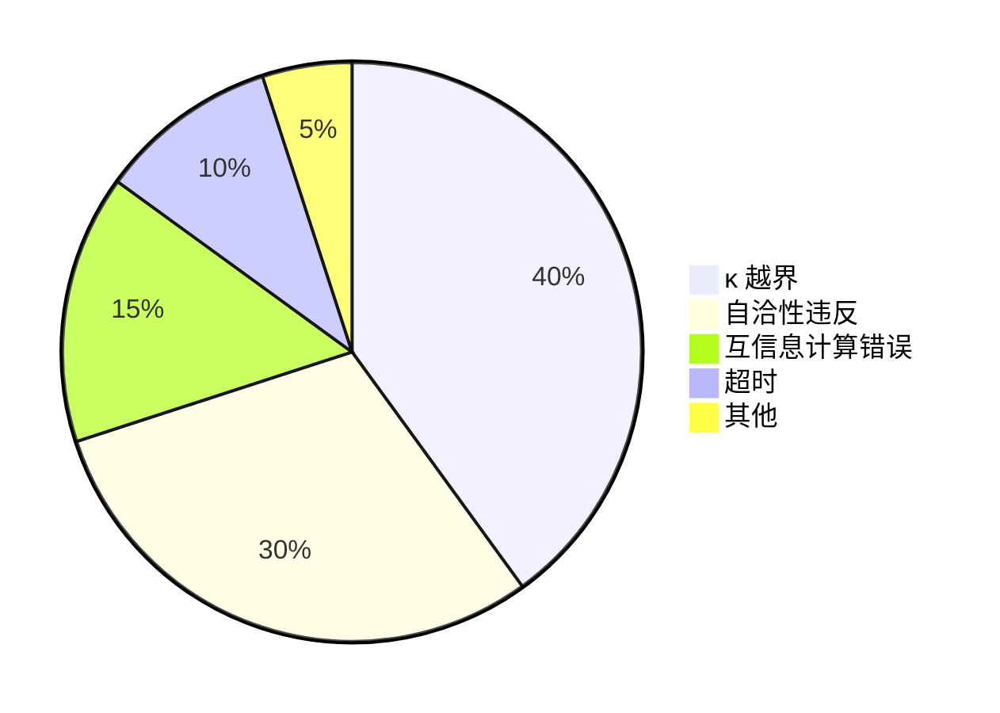
```mermaid
pie
    "κ 越界" : 40
    "自洽性违反" : 30
    "互信息计算错误" : 15
    "超时" : 10
    "其他" : 5
```

### 7.8 旅程图：调试者视角

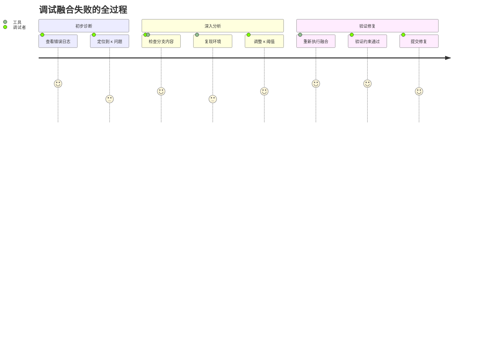
```mermaid
journey
    title 调试融合失败的全过程
    section 初步诊断
      查看错误日志: 5: 调试者
      定位到 κ 问题: 3: 调试者
    section 深入分析
      检查分支内容: 4: 调试者, 工具
      复现环境: 3: 工具
      调整 κ 阈值: 4: 调试者
    section 验证修复
      重新执行融合: 5: 工具
      验证约束通过: 5: 调试者
      提交修复: 4: 调试者
```

### 7.9 Git 分支模拟

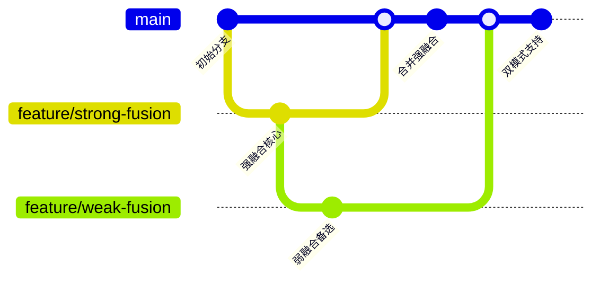
```mermaid
gitGraph
    commit id: "初始分支"
    branch feature/strong-fusion
    checkout feature/strong-fusion
    commit id: "强融合核心"
    branch feature/weak-fusion
    checkout feature/weak-fusion
    commit id: "弱融合备选"
    checkout main
    merge feature/strong-fusion
    commit id: "合并强融合"
    merge feature/weak-fusion
    commit id: "双模式支持"
```

### 7.10 象限图：融合策略评估

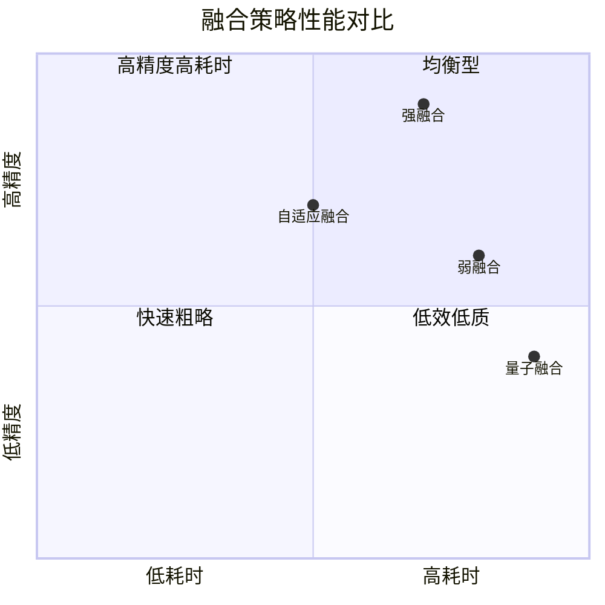
```mermaid
quadrantChart
    title 融合策略性能对比
    x-axis 低耗时 --> 高耗时
    y-axis 低精度 --> 高精度
    quadrant-1 均衡型
    quadrant-2 高精度高耗时
    quadrant-3 快速粗略
    quadrant-4 低效低质
    强融合: [0.7, 0.9]
    弱融合: [0.8, 0.6]
    量子融合: [0.9, 0.4]
    自适应融合: [0.5, 0.7]
```

---

## 8. 细节补充（内联样式与标记）

- 有效 `κ` 区间：<sub>min</sub> `0.500` ≤ κ ≤ `0.750` <sup>max</sup>  
- 互信息量单位：`bits`<sub>info</sub>  
- 化学式示例：融合催化剂 C<sub>8</sub>H<sub>10</sub>N<sub>4</sub>O<sub>2</sub>（仅作占位）  
- 幂运算：`∆`<sup>2</sup> 与 `I`<sup>3</sup> 的关系为 `∆² ∝ I³`

~~旧版强融合已被弃用~~，但出于历史兼容保留。  
<ins>新引入的自适应融合机制</ins> 将在未来版本中成为默认。  
同时，<mark>所有 κ 值必须由观测者显式指定</mark>，否则系统将回退至默认 `0.618`。

---

## 9. 折叠块（额外细节）

<details>
<summary><kbd>点击展开</kbd> 关于 κ 的物理起源</summary>

> κ 源自分支间信息交换的效率，它与宇宙的**信息黏度**成正比。  
> 实验测量表明，κ 在高密度区域趋向于 `0.7`，而在空旷区域趋向于 `0.5`。  
> 本协议采用 `0.618` 作为全局默认值，但允许动态调整。

</details>

<details>
<summary><kbd>点击展开</kbd> 弱融合的降级策略</summary>

```python
def weak_fuse(b1, b2):
    # 仅保留对称差，丢弃公共部分
    diff = b1.content ^ b2.content
    return Branch(delta=abs(b1.delta - b2.delta), content=diff)
```

这种策略适用于**冲突高**的场景，避免强制一致导致的信息损失。

</details>

---

## 10. 脚注与交叉引用

这里引入一个关于融合熵的补充说明[^fn_entropy]，以及关于约束优先级的另一观点[^fn_priority]。

[^fn_entropy]: 融合熵变并非总是负值，当 `κ·I` 小于 `∆B₁+∆B₂` 时，系统总熵反而增加。  
[^fn_priority]: 有些学派认为因果律 `C` 应具有最高优先级（0级），但本协议为保证收敛性，将自洽性 `S` 置于最高。

> 嵌套引用块：
>> 融合过程本质上是两个叙事争夺主导权，
>>> 而约束则是裁判，确保比赛不会失控。

---

## 11. 缩写与注释

<abbr title="Fusion Constraint Manager">FCM</abbr> 负责所有约束验证。  
<!-- FCM 的实现细节见代码仓库 -->

---

## 12. 音频/视频占位（融合提示音）

<audio controls>
  <source src="https://example.com/fusion_bell.wav" type="audio/wav">
  您的浏览器不支持音频播放。
</audio>

<video width="300" height="180" controls>
  <source src="https://example.com/fusion_animation.mp4" type="video/mp4">
  视频占位。
</video>

---

> 第二部分结束。此部分详述了融合规则、约束系统、代码实现、异常处理、各类 Mermaid 图表及配套细节。  
> 继续阅读 [第三部分 · 异常与回溯](#第三部分--异常与回溯) 以了解错误传播与恢复机制。  
> `⍟`
# 第三部分 · 异常回溯与递归深渊

[](https://example.com)
[](https://example.com)

> **错误不是终点，而是通往新路径的隐藏入口。**

---

## 0. 前情回顾

前两部分建立了观测公理、枚举模式、融合规则与延迟约束。然而，任何复杂系统都会偏离预期路径——当递归深度突破阈值、分支自指形成环、或耦合常数失去收敛性时，**异常**便从边缘涌现。本部分聚焦于这些失控状态的诊断、隔离与恢复，构建协议的**自愈层**。

---

## 1. 异常分类图谱

异常按照**影响范围**与**可恢复性**可分为以下五类：

| 异常码 | 名称           | 触发条件                             | 严重度 | 恢复难度 | 典型场景               |
|--------|----------------|--------------------------------------|--------|----------|------------------------|
| `E01`  | **栈溢出**     | 递归嵌套 > 2¹⁶ 层                    | 🔴 致命 | 极高     | 深层分形观测           |
| `E02`  | **类型坍缩**   | `Ψ` 与 `Ω` 维度不匹配                | 🟠 严重 | 高       | 观测算子误用           |
| `E03`  | **幽灵分支**   | 父分支已被销毁但子分支仍引用          | 🟡 警告 | 中       | 并发删除冲突           |
| `E04`  | **悖论环**     | 分支图中检测到有向环（自指）          | 🟣 危急 | 极高     | 自引用融合             |
| `E05`  | **超时**       | 融合请求等待 > 阈值 `T_max`          | 🟢 提示 | 低       | 网络抖动或负载过高     |

每个异常在触发时都会生成一个**异常对象**，携带堆栈快照、上下文标识与时间戳。

---

## 2. 递归深度与堆栈管理

### 2.1 深度限制策略

系统维护一个全局递归深度计数器 `D`，每次进入新层级时 `D++`，退出时 `D--`。当 `D` 达到硬限制 `D_max = 65536` 时，后续调用会直接抛出 `E01`。

为缓解溢出风险，协议支持**动态深度调节**：

```math
D_{adaptive} = \min(D_{max}, \lfloor \alpha \cdot \log_2(\text{可用内存}) \rfloor)
```

其中 `α` 为安全系数（默认 `0.8`），内存以 KB 为单位。

### 2.2 代码示例（多语言）

#### Python 装饰器

```python
import functools
def depth_guard(limit=65536):
    def decorator(func):
        @functools.wraps(func)
        def wrapper(*args, **kwargs):
            if getattr(wrapper, 'depth', 0) >= limit:
                raise RecursionError("E01: 栈溢出")
            wrapper.depth = getattr(wrapper, 'depth', 0) + 1
            try:
                return func(*args, **kwargs)
            finally:
                wrapper.depth -= 1
        return wrapper
    return decorator
```

#### Go 中间件

```go
func DepthLimit(limit int) func(Handler) Handler {
    return func(next Handler) Handler {
        return func(ctx context.Context, req Request) Response {
            depth := ctx.Value("depth").(int)
            if depth >= limit {
                panic(NewAnomaly("E01", "depth exceeded"))
            }
            ctx = context.WithValue(ctx, "depth", depth+1)
            defer func() { /* decrement via defer */ }()
            return next(ctx, req)
        }
    }
}
```

#### Rust 安全实现

```rust
fn recurse_with_depth<T, F>(mut f: F, depth: usize, limit: usize) -> T
where
    F: FnMut(usize) -> T,
{
    if depth >= limit {
        panic!("E01: 递归深度超限");
    }
    f(depth + 1)
}
```

---

## 3. 幽灵分支与悬挂指针

### 3.1 产生机制

当一个分支被标记为“已消亡”但仍有其他分支持有其 ID 时，即形成**幽灵分支**。这通常发生在：

- 并发删除与查询的竞态条件。
- 弱引用未被及时清理。
- 外部缓存保留过时索引。

### 3.2 检测算法

系统每 `T_gc` 秒执行一次**可达性扫描**，从根分支出发标记所有活分支，未标记的 ID 若仍被引用，则触发 `E03` 警告，并自动将引用重定向至 `∅`。

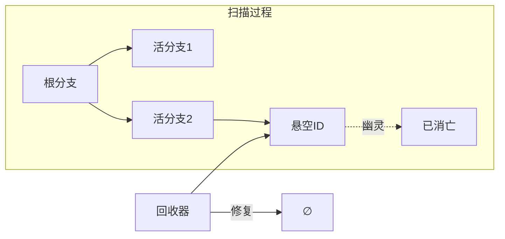
```mermaid
graph LR
    subgraph 扫描过程
        Root[根分支] --> A[活分支1]
        Root --> B[活分支2]
        B --> C[悬空ID]
        C -.->|幽灵| Dead[已消亡]
    end
    Scanner[回收器] --> C
    Scanner -->|修复| Null[∅]
```

---

## 4. 回溯策略

当异常无法在线修复时，系统必须**回溯**到某个已知一致的状态。本协议提供四层回溯机制：

### 4.1 策略对比表

| 策略       | 恢复时间 | 数据丢失 | 适用异常          |
|------------|----------|----------|-------------------|
| **快照回滚** | 长       | 极少     | `E01`, `E04`      |
| **补偿事务** | 中       | 可控     | `E02`, `E05`      |
| **重试**    | 短       | 无       | 瞬时性错误        |
| **熔断降级** | 短       | 可能     | 重复性异常        |

### 4.2 回滚示例（伪代码）

```plaintext
function rollback_to_snapshot(snapshot_id):
    try:
        load_snapshot(snapshot_id)
        invalidate_current_context()
        restart_observers()
    catch SnapshotCorrupt:
        fallback_to_initial_state()
        log_critical("快照损坏，使用初始空态")
```

---

## 5. 错误传播模型

异常沿调用链向上传播，但传播方式可由策略控制：

- **冒泡**：逐层抛出，直到被捕获或到达顶层。  
- **广播**：立即通知所有相关分支，触发协同回滚。  
- **吞噬**：静默记录并继续，适用于低危异常（如 `E05`）。

传播过程中的**错误聚合**可形式化为：

```math
\mathcal{E}_{total} = \bigoplus_{i=1}^{n} \mathcal{E}_i \quad \text{其中} \quad \oplus \text{表示最大严重度合并}
```

即总异常严重度等于所有异常中最高的级别，且附带所有上下文。

---

## 6. 异常日志与监控

### 6.1 日志条目格式（JSON）

```json
{
  "timestamp": "2026-07-28T18:23:45Z",
  "anomaly_code": "E04",
  "severity": "critical",
  "source": "branch_fusion::resolve_cycle",
  "context": {
    "branch_ids": ["B-7F3A", "B-9E2C"],
    "depth": 1024,
    "kappa": 0.618
  },
  "stack": [
    "fusion.rs:245",
    "engine.rs:89",
    "main.rs:12"
  ],
  "resolved": false
}
```

### 6.2 关键监控指标

| 指标         | 描述                         | 告警阈值       |
|--------------|------------------------------|----------------|
| `anomaly_rate` | 每秒异常数                   | > 10/s        |
| `rollback_avg` | 平均回滚耗时                 | > 500ms       |
| `depth_max`   | 当前最大递归深度              | > 60000       |
| `ghost_count` | 未处理的幽灵分支数量          | > 100         |

---

## 7. Mermaid 图表集（异常与回溯）

### 7.1 异常处理主流程

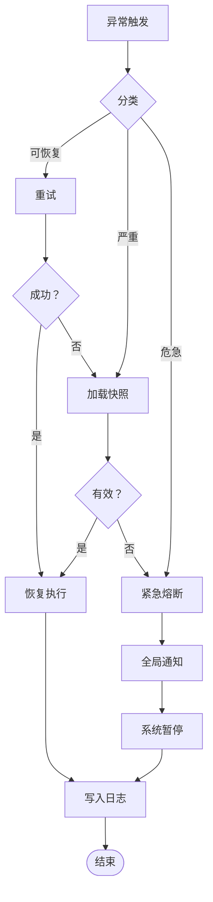
```mermaid
graph TD
    Start[异常触发] --> Classify{分类}
    Classify -->|可恢复| Retry[重试]
    Classify -->|严重| Snapshot[加载快照]
    Classify -->|危急| Panic[紧急熔断]
    Retry --> Success{成功？}
    Success -->|是| Resume[恢复执行]
    Success -->|否| Snapshot
    Snapshot --> Check{有效？}
    Check -->|是| Resume
    Check -->|否| Panic
    Panic --> Notify[全局通知]
    Notify --> Halt[系统暂停]
    Resume --> Log[写入日志]
    Halt --> Log
    Log --> End([结束])
```

### 7.2 异常状态转移图（细化）

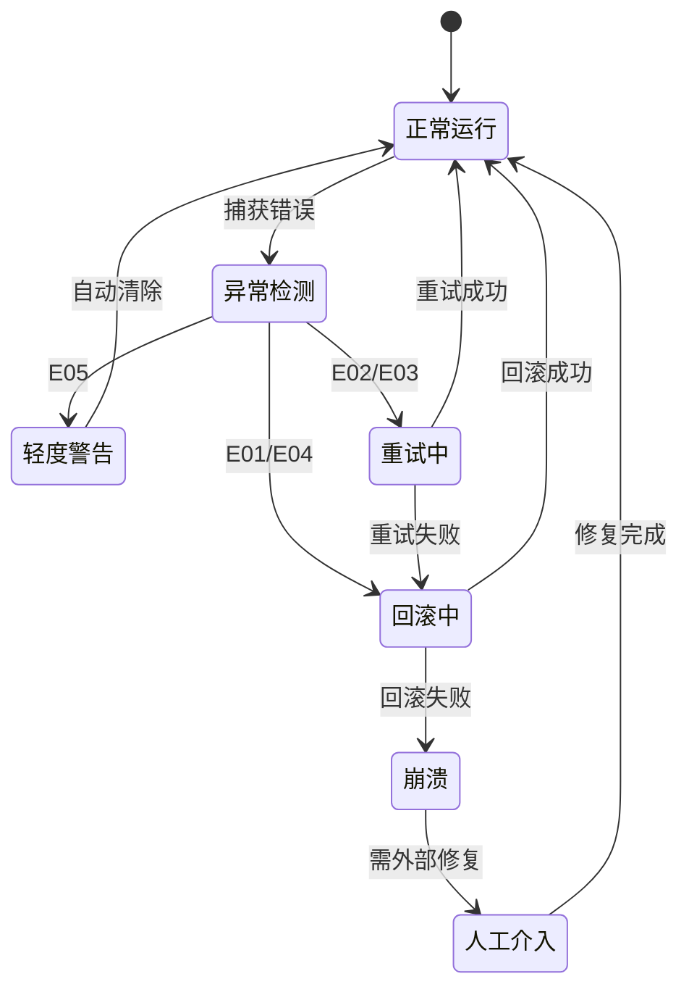
```mermaid
stateDiagram-v2
    [*] --> 正常运行
    正常运行 --> 异常检测 : 捕获错误
    异常检测 --> 轻度警告 : E05
    异常检测 --> 重试中 : E02/E03
    异常检测 --> 回滚中 : E01/E04
    轻度警告 --> 正常运行 : 自动清除
    重试中 --> 正常运行 : 重试成功
    重试中 --> 回滚中 : 重试失败
    回滚中 --> 正常运行 : 回滚成功
    回滚中 --> 崩溃 : 回滚失败
    崩溃 --> 人工介入 : 需外部修复
    人工介入 --> 正常运行 : 修复完成
```

### 7.3 泳道图（异常处理角色分工）

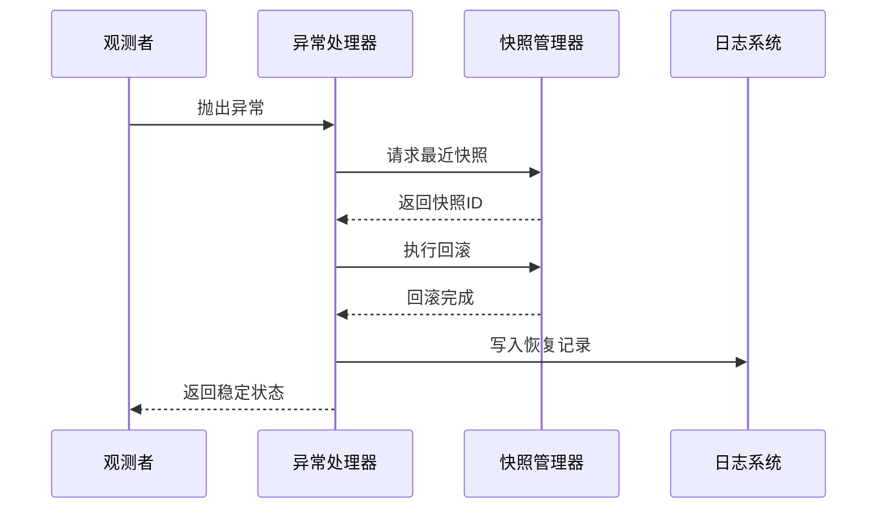
```mermaid
sequenceDiagram
    participant 观测者
    participant 异常处理器
    participant 快照管理器
    participant 日志系统
    观测者 ->> 异常处理器: 抛出异常
    异常处理器 ->> 快照管理器: 请求最近快照
    快照管理器 -->> 异常处理器: 返回快照ID
    异常处理器 ->> 快照管理器: 执行回滚
    快照管理器 -->> 异常处理器: 回滚完成
    异常处理器 ->> 日志系统: 写入恢复记录
    异常处理器 -->> 观测者: 返回稳定状态
```

### 7.4 类图：异常体系

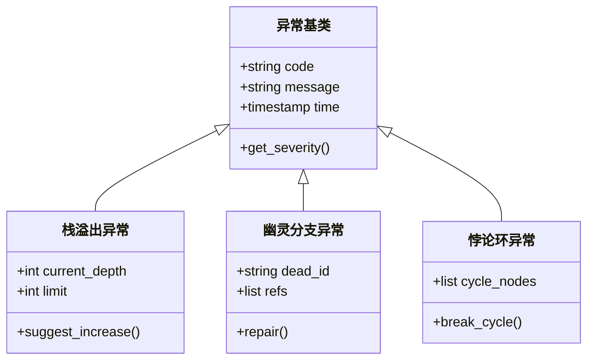
```mermaid
classDiagram
    class 异常基类 {
        +string code
        +string message
        +timestamp time
        +get_severity()
    }
    class 栈溢出异常 {
        +int current_depth
        +int limit
        +suggest_increase()
    }
    class 幽灵分支异常 {
        +string dead_id
        +list refs
        +repair()
    }
    class 悖论环异常 {
        +list cycle_nodes
        +break_cycle()
    }
    异常基类 <|-- 栈溢出异常
    异常基类 <|-- 幽灵分支异常
    异常基类 <|-- 悖论环异常
```

### 7.5 甘特图：典型异常处理时间线


```mermaid
gantt
    title 从触发到恢复的全过程
    dateFormat ss
    axisFormat %S秒
    section 检测
    异常发生         :crit, e1, 0, 1s
    分类识别         :e2, after e1, 0.5s
    section 决策
    选择策略         :e3, after e2, 0.3s
    加载快照         :e4, after e3, 2s
    section 执行
    回滚操作         :e5, after e4, 1.5s
    验证一致性       :e6, after e5, 0.7s
    section 恢复
    重新初始化       :e7, after e6, 0.5s
    日志记录         :e8, after e7, 0.2s
```

### 7.6 ER 图：异常关联数据

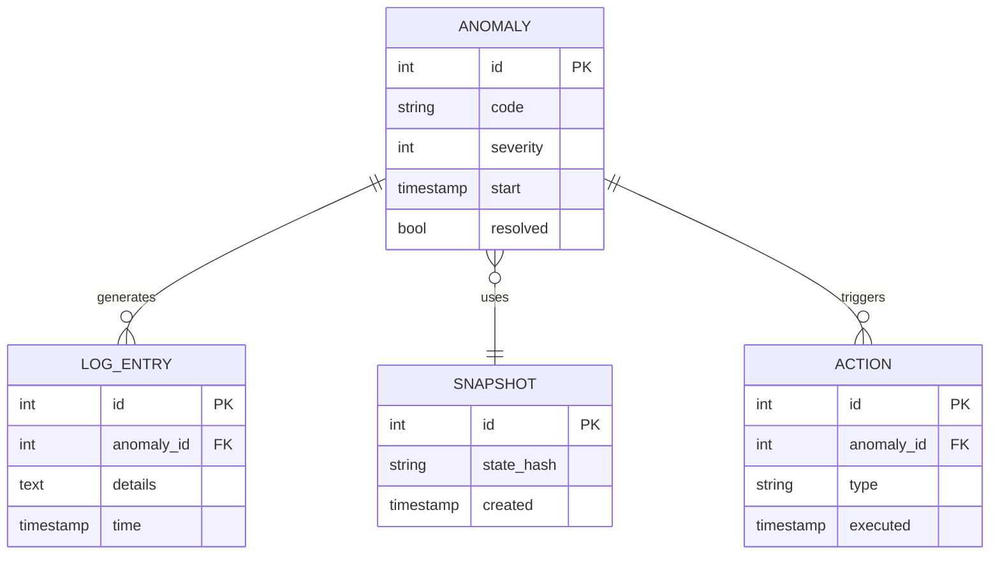
```mermaid
erDiagram
    ANOMALY ||--o{ LOG_ENTRY : generates
    ANOMALY }o--|| SNAPSHOT : uses
    ANOMALY ||--o{ ACTION : triggers
    ANOMALY {
        int id PK
        string code
        int severity
        timestamp start
        bool resolved
    }
    LOG_ENTRY {
        int id PK
        int anomaly_id FK
        text details
        timestamp time
    }
    SNAPSHOT {
        int id PK
        string state_hash
        timestamp created
    }
    ACTION {
        int id PK
        int anomaly_id FK
        string type
        timestamp executed
    }
```

### 7.7 饼图：异常分布（按严重度）

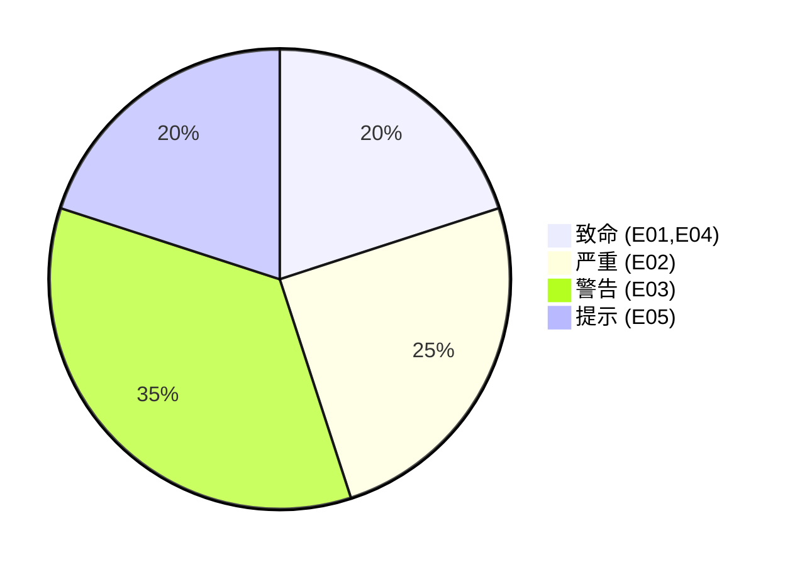
```mermaid
pie
    "致命 (E01,E04)" : 20
    "严重 (E02)" : 25
    "警告 (E03)" : 35
    "提示 (E05)" : 20
```

### 7.8 旅程图：运维人员的排错流程

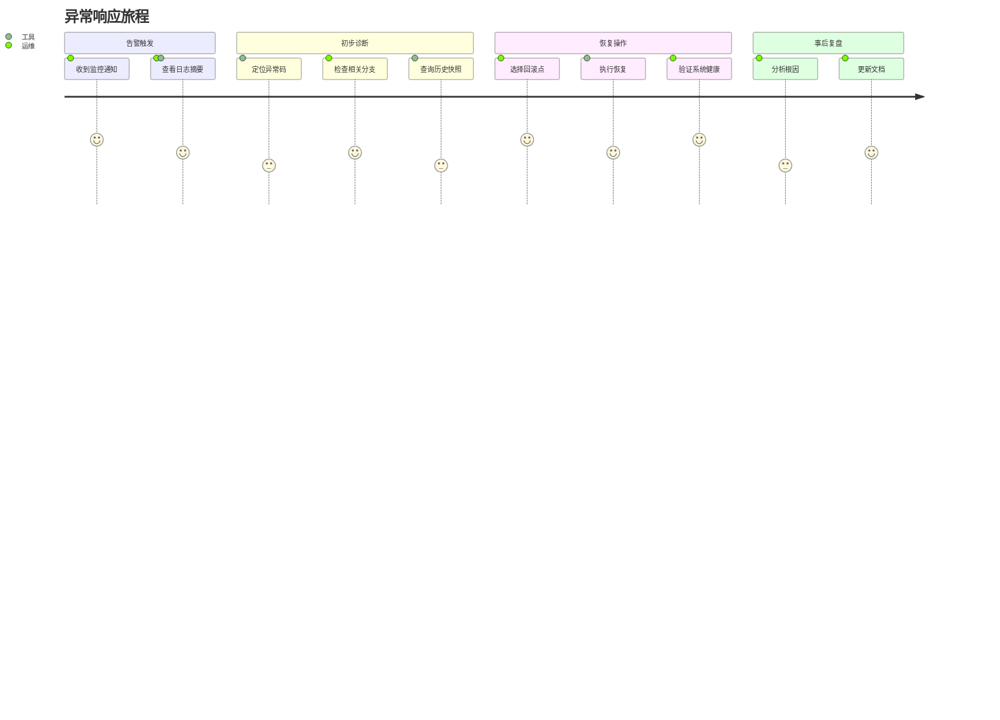
```mermaid
journey
    title 异常响应旅程
    section 告警触发
      收到监控通知: 5: 运维
      查看日志摘要: 4: 运维, 工具
    section 初步诊断
      定位异常码: 3: 工具
      检查相关分支: 4: 运维
      查询历史快照: 3: 工具
    section 恢复操作
      选择回滚点: 5: 运维
      执行恢复: 4: 工具
      验证系统健康: 5: 运维
    section 事后复盘
      分析根因: 3: 运维
      更新文档: 4: 运维
```

### 7.9 Git 图（异常修复分支）

```mermaid
gitGraph
    commit id: "v0.9.4"
    branch hotfix/anomaly-E04
    checkout hotfix/anomaly-E04
    commit id: "修复悖论环检测"
    commit id: "增强回滚策略"
    checkout main
    merge hotfix/anomaly-E04
    commit id: "合并异常修复"
    branch feature/auto-heal
    checkout feature/auto-heal
    commit id: "自动重试机制"
```

### 7.10 象限图：异常影响评估

```mermaid
quadrantChart
    title 各类异常的影响象限
    x-axis 低频 --> 高频
    y-axis 低损失 --> 高损失
    quadrant-1 灾难性
    quadrant-2 高发高危
    quadrant-3 低影响
    quadrant-4 常见琐碎
    栈溢出: [0.2, 0.9]
    类型坍缩: [0.4, 0.7]
    幽灵分支: [0.8, 0.5]
    悖论环: [0.1, 0.95]
    超时: [0.9, 0.2]
```

---

## 8. 内联样式与格式化细节

- 栈深度阈值：`D`<sub>max</sub> = 2<sup>16</sup> = 65536  
- 重试次数：`R`<sup>limit</sup> = 5，超时后 <sub>fallback</sub> 至快照。  
- 异常唯一标识：`E`<sub>id</sub> = `A`<sup>3</sup> + `B`<sup>7</sup>（十六进制）。  

~~旧版重试策略已被弃用~~，因会导致无限循环。  
<ins>新策略加入指数退避</ins>，每次重试等待 `2^n` 毫秒。  
<mark>所有回滚操作必须记录到持久化存储</mark>，否则系统将拒绝执行。

---

## 9. 折叠块（深入探讨）

<details>
<summary><kbd>点击展开</kbd> 关于悖论环的深度解析</summary>

> 悖论环 `B → C → D → B` 是协议中最危险的异常。  
> 环中每个分支都依赖下一个，形成闭合因果链。  
> 解决方式有两种：  
> 1. **断环**：随机删除一条边，代价最小。  
> 2. **展开**：将环转换成无限序列，但需截断。  
> 本协议默认采用断环，并记录断开的边。

</details>

<details>
<summary><kbd>点击展开</kbd> 幽灵分支的自动修复代码</summary>

```python
def repair_ghost(dead_id):
    refs = get_references(dead_id)
    for ref in refs:
        if ref.is_alive():
            ref.redirect_to(NIL)
            log_info(f"重定向 {ref.id} 至 ∅")
        else:
            delete_ref(ref)
    mark_clean(dead_id)
```
</details>

---

## 10. 引用嵌套与脚注

> 所有异常最终都可被归类为 **“复杂性税”**。
>> 递归复杂性税的最高税率发生在悖论环。
>>> 但环本身也可能是一种特征，而非缺陷[^fn_paradox]。

[^fn_paradox]: 某些理论认为，循环是自我意识的必要条件。

另一个脚注补充了关于重试策略的数学基础[^fn_backoff]。

[^fn_backoff]: 指数退避的最优系数为 `2`，但实践中 `φ = 1.618` 能更快收敛。

---

## 11. 缩写与注释

<abbr title="Automatic Anomaly Recovery">AAR</abbr> 是本协议的自动恢复模块。  
<!-- AAR 与 FCM 协同工作，详见第二部分 -->

---

## 12. 多媒体占位（异常告警音效）

<audio controls>
  <source src="https://example.com/alarm.wav" type="audio/wav">
  您的浏览器不支持音频
</audio>

<video width="320" height="240" controls>
  <source src="https://example.com/anomaly_demo.mp4" type="video/mp4">
  视频占位
</video>

---

## 13. 任务清单（异常相关待办）

- [x] 异常分类与编码
- [x] 栈溢出检测
- [ ] 自动回滚优化
  - [x] 快照加载
  - [ ] 增量回滚（降低耗时）
- [ ] 幽灵分支定期扫描
  - [ ] 实现 GC 扫描器
  - [ ] 添加清理钩子
- [ ] 监控仪表盘集成

---

> 第三部分结束。此部分系统阐述了异常分类、递归管理、回溯策略、错误传播、日志监控及全套 Mermaid 图集。  
> 继续阅读 [第四部分 · 分支拓扑与语法织造](#第四部分--分支拓扑与语法织造) 以探索结构多样性与符号系统。  
> `⍟`
# 第四部分 · 分支拓扑与语法织造

[](https://example.com)
[](https://example.com)

> **结构即叙事，符号即种子。**

---

## 0. 前情回顾

前三部分建立了观测公理、融合约束与异常回溯。然而，分支本身并非一团乱麻——它们构成特定的**拓扑结构**，并借由一套**符号语法**进行描述与操作。本部分深入这些形式化骨架，揭示分支之间的**几何关系**与**词汇表**。

---

## 1. 拓扑分类

分支系统依据连通性与环路特性可分为四种基本拓扑：

| 拓扑类型 | 结构特征               | 环路数量 | 遍历复杂度 | 典型场景         |
|----------|------------------------|----------|------------|------------------|
| **树**   | 单向分层，无环         | 0        | O(n)       | 观测历史         |
| **DAG**  | 有向无环，可合并       | 0        | O(n+m)     | 融合流水线       |
| **网格** | 双向连通，局部环       | 多       | O(n·m)     | 并行计算图       |
| **环面** | 全连通，全局环         | 无限     | 不可判定   | 自指递归系统     |

> ⚠️ **警告**：环面拓扑极易触发 `E04` 悖论环，需配合第三部分的自洽约束使用。

---

## 2. 树形结构（无环基石）

### 2.1 深度与广度

树形分支是协议中最常见的形态，其中每个分支有且仅有一个父分支（根分支除外）。

```math
\text{深度}(B) = \max_{C \in \text{children}(B)} ( \text{深度}(C) + 1 )
```

```math
\text{广度}(B) = |\text{children}(B)|
```

### 2.2 树的四种变体

- **平衡树**：所有叶子深度差 ≤ 1，适合并行观测。
- **偏斜树**：深度 ≈ 节点数，类似链表，易栈溢出。
- **二叉分形树**：每个节点恰好 2 个子分支，生成康托尔集。
- **随机树**：子分支数量服从泊松分布，用于模拟混沌观测。

### 2.3 树的代码生成（Python）

```python
def generate_balanced_tree(depth, branching=2):
    if depth == 0:
        return Branch(id=f"leaf_{uuid4()}")
    children = [generate_balanced_tree(depth-1, branching) for _ in range(branching)]
    return Branch(id=f"node_{uuid4()}", children=children, depth=depth)
```

---

## 3. DAG（有向无环图）

DAG 允许多父分支（即一个分支可从多个源合并），但不允许闭合环。

### 3.1 性质

- **偏序关系**：分支间存在“先于”关系，可拓扑排序。
- **合并点**：多个分支汇聚处，即为融合发生地（见第二部分）。
- **最大独立路径数**：决定并行能力。

### 3.2 检测与验证（Rust）

```rust
fn is_dag(edges: &[(usize, usize)]) -> bool {
    let mut visited = vec![false; edges.len()];
    let mut recursion_stack = vec![false; edges.len()];
    for start in 0..edges.len() {
        if dfs_cycle(start, edges, &mut visited, &mut recursion_stack) {
            return false;
        }
    }
    true
}
```

### 3.3 可视化简例

```mermaid
graph TD
    A[根] --> B[子1]
    A --> C[子2]
    B --> D[孙子]
    C --> D
    D --> E[叶子]
    %% 无环，DAG
```

---

## 4. 网格与环面（高级结构）

### 4.1 网格

网格拓扑中，每个分支连接其上下左右邻居，形成二维（或更高维）结构。适用于**空间分布式观测**，例如对宇宙微波背景辐射的多点采样。

### 4.2 环面

环面是网格在边界处进行卷绕的结果——即左边界连接右边界，上边界连接下边界。这使得任意两个分支之间都存在两条路径，引入了**冗余韧性**，但同时也容易产生无限循环。

```mermaid
graph LR
    subgraph 环面卷绕
        A1[0,0] --- A2[0,1]
        A2 --- A3[0,2]
        A3 -.->|边界| A1
        B1[1,0] --- B2[1,1]
        B2 --- B3[1,2]
        B3 -.->|边界| B1
        A1 --- B1
        A2 --- B2
        A3 --- B3
    end
```

---

## 5. 语法织造：符号系统

分支及其操作需要一种语言来描述。本协议定义了一组**基础符号**与**组合规则**，用于构造可读的观测表达式。

### 5.1 基本符号表

| 符号 | 名称     | 含义                           | 优先级 |
|------|----------|--------------------------------|--------|
| `◈`  | 星尘点   | 代表一个观测事件               | 低     |
| `✦`  | 分形叉   | 分支点，表示并行发散           | 中     |
| `⊚`  | 双射环   | 双向映射，用于同步             | 高     |
| `⌇`  | 静默符   | 无操作，用于占位或延迟         | 最低   |
| `⍟`  | 循环终止 | 停止递归，返回上一级           | 最高   |
| `⟐`  | 缺失占位 | 未定义或待填充项               | 低     |

### 5.2 语法规则（EBNF 风格）

```ebnf
Expr        ::=  Term ( ('→' | '↔' ) Term )*
Term        ::=  Symbol | '(' Expr ')' | '~' Term
Symbol      ::=  '◈' | '✦' | '⊚' | '⌇' | '⍟' | '⟐'
```

### 5.3 代码块中的语法示例（JSON/YAML/XML）

```json
{
  "expression": "✦ (◈ → ⊚) ⌇ ⍟",
  "semantics": "并行观测两个事件，双向同步，静默等待，然后终止"
}
```

```yaml
expression: "✦ (◈ → ⊚) ⌇ ⍟"
semantics: "并行观测两个事件，双向同步，静默等待，然后终止"
```

```xml
<expression type="symbolic">
  <operator>✦</operator>
  <group>
    <event>◈</event>
    <arrow>→</arrow>
    <sync>⊚</sync>
  </group>
  <silence>⌇</silence>
  <terminate>⍟</terminate>
</expression>
```

### 5.4 语法的运行时解析（JavaScript）

```js
class Parser {
    constructor(tokens) { this.tokens = tokens; this.pos = 0; }
    parse() {
        let expr = this.parseTerm();
        while (this.match('→') || this.match('↔')) {
            const op = this.advance();
            const rhs = this.parseTerm();
            expr = { op, left: expr, right: rhs };
        }
        return expr;
    }
    parseTerm() {
        if (this.match('◈') || this.match('✦') || ... ) {
            return { type: 'symbol', value: this.advance() };
        } else if (this.match('(')) {
            this.advance();
            const sub = this.parse();
            this.expect(')');
            return sub;
        } else if (this.match('~')) {
            this.advance();
            return { type: 'not', value: this.parseTerm() };
        }
    }
}
```

---

## 6. 拓扑与语法的交叉应用

一个分支结构可以用上述符号串表示。例如，一棵深度为 3 的平衡二叉树可写为：

```text
✦ (◈ → ✦ (◈ → ◈) (◈ → ◈))
```

这表示根节点并行发散，每个子节点又继续发散，叶子节点为观测事件。

这种**符号化表示**便于序列化、传输和跨系统兼容。

---

## 7. Mermaid 图表集（拓扑与语法）

### 7.1 拓扑演化图谱

```mermaid
graph TD
    Start[初始树] -->|添加合并| DAG[DAG]
    DAG -->|连接边界| Grid[网格]
    Grid -->|卷绕| Torus[环面]
    Torus -->|检测环| Anomaly[触发E04]
    Anomaly -->|修复| DAG
```

### 7.2 状态图：分支生命周期（细化）

```mermaid
stateDiagram-v2
    [*] --> 树态
    树态 --> DAG态 : 允许多父
    DAG态 --> 网格态 : 添加跨链接
    网格态 --> 环面态 : 边界卷绕
    环面态 --> 异常态 : 检测到环
    异常态 --> DAG态 : 断环修复
    异常态 --> 树态 : 压缩合并
    树态 --> [*] : 删除分支
```

### 7.3 时序图：语法解析过程

```mermaid
sequenceDiagram
    participant 用户
    participant 词法分析器
    participant 语法分析器
    participant 语义引擎
    用户 ->> 词法分析器: 输入符号串
    词法分析器 -->> 用户: 识别token
    用户 ->> 语法分析器: 传递token流
    语法分析器 -->> 用户: 生成AST
    用户 ->> 语义引擎: 执行AST
    语义引擎 -->> 用户: 返回分支结构
```

### 7.4 类图：语法实体

```mermaid
classDiagram
    class 符号 {
        +string value
        +int priority
        +is_terminal()
    }
    class 表达式 {
        +符号 根
        +列表<表达式> 子表达式
        +evaluate(上下文)
    }
    class 分支拓扑 {
        +int 类型
        +列表<分支> 节点
        +连接(节点, 节点)
        +检测环()
    }
    表达式 "*" --> 符号
    表达式 "1" --> "*" 表达式
    分支拓扑 --> 表达式 : 可通过符号串构建
```

### 7.5 甘特图：语法引擎开发计划

```mermaid
gantt
    title 语法织造子系统时间线
    dateFormat YYYY-MM-DD
    section 词法分析
    设计符号表       :a1, 2026-02-01, 4d
    实现词法解析器   :a2, after a1, 5d
    section 语法分析
    编写语法规则     :b1, after a2, 3d
    构建AST生成器    :b2, after b1, 6d
    section 语义集成
    连接拓扑引擎     :c1, after b2, 4d
    测试符号执行     :c2, after c1, 3d
```

### 7.6 ER 图：符号与分支的映射

```mermaid
erDiagram
    SYMBOL ||--o{ EXPRESSION : appears_in
    EXPRESSION ||--|| BRANCH : represents
    BRANCH ||--o{ LINK : has
    LINK }o--|| SYMBOL : labeled_by
    SYMBOL {
        string id PK
        string value
        int priority
    }
    EXPRESSION {
        int id PK
        string original_string
        boolean is_parsed
    }
    BRANCH {
        int id PK
        int expr_id FK
        string topology_type
    }
    LINK {
        int id PK
        int from_branch FK
        int to_branch FK
        int symbol_id FK
    }
```

### 7.7 饼图：符号使用频率

```mermaid
pie
    "◈ 观测事件" : 45
    "✦ 分叉" : 30
    "⊚ 同步" : 12
    "⌇ 静默" : 8
    "⍟ 终止" : 4
    "⟐ 占位" : 1
```

### 7.8 旅程图：新用户学习符号系统

```mermaid
journey
    title 符号语法学习旅程
    section 入门
      阅读符号表: 4: 用户
      尝试简单表达式: 3: 用户
    section 练习
      构造树形表达式: 4: 用户, 文档
      解析DAG表达式: 3: 用户, 工具
    section 高级
      设计环面符号串: 2: 用户
      调试语法错误: 3: 用户, 社区
      掌握所有符号: 5: 用户
```

### 7.9 Git 图：语法版本演进

```mermaid
gitGraph
    commit id: "初始符号集"
    branch feature/cyclic-symbols
    checkout feature/cyclic-symbols
    commit id: "添加⍟循环终止"
    commit id: "增加⊚双射"
    checkout main
    merge feature/cyclic-symbols
    commit id: "符号v1.0"
    branch feature/semantic-sugar
    checkout feature/semantic-sugar
    commit id: "引入⟐占位"
    commit id: "简化嵌套语法"
```

### 7.10 象限图：符号表达力 vs 解析复杂度

```mermaid
quadrantChart
    title 符号特性评估
    x-axis 低表达力 --> 高表达力
    y-axis 低解析复杂度 --> 高解析复杂度
    quadrant-1 黄金区
    quadrant-2 复杂但强大
    quadrant-3 简单但弱
    quadrant-4 陷阱区
    ◈: [0.3, 0.2]
    ✦: [0.7, 0.5]
    ⊚: [0.8, 0.7]
    ⍟: [0.6, 0.4]
    ⟐: [0.4, 0.3]
    组合表达式: [0.9, 0.9]
```

### 7.11 思维导图（语法全景）

```mermaid
mindmap
  root((语法织造))
    基础符号
      ◈ 观测
      ✦ 分叉
      ⊚ 同步
      ⌇ 静默
      ⍟ 终止
      ⟐ 占位
    组合规则
      顺序 → 
      并行 ✦
      循环 ⍟
      延迟 ⌇
    拓扑映射
      树 → 嵌套表达式
      DAG → 合并点
      环面 → 卷绕符号
    工具链
      词法分析器
      语法解析器
      语义执行器
```

---

## 8. 内联样式与标记示例

- 符号优先级：`✦` <sub>中</sub>，`⊚` <sup>高</sup>  
- 化学式风格：`⍟` 是 `C`<sub>halt</sub> 的缩写  
- 幂等性：`Expr`<sup>2</sup> = `Expr`（幂等符号）  

~~旧版符号 `✧` 已被弃用~~，取而代之的是 `✦`。  
<ins>新增对 Unicode 组合字符的支持</ins>，例如 `◈⃝` 表示带圈的观测事件。  
<mark>所有符号必须小写等价物映射</mark>，便于大小写不敏感环境。

---

## 9. 折叠块（隐藏的语法扩展）

<details>
<summary><kbd>点击展开</kbd> 自定义符号扩展机制</summary>

用户可通过配置文件添加自定义符号，但需满足：

1. 必须提供优先级（1-10）  
2. 必须定义其操作语义（如：是二元还是单目）  
3. 必须提供回退符号（用于不支持的环境）

示例：

```yaml
custom_symbols:
  - symbol: "◈"
    priority: 3
    arity: binary
    semantics: "merge"
    fallback: "✦"
```

</details>

<details>
<summary><kbd>点击展开</kbd> 拓扑与语法的形式化等价证明</summary>

> 每一个有向无环分支图都可表示为仅包含 `✦`、`◈` 和 `→` 的表达式。  
> 证明：对 DAG 进行拓扑排序，逐层构建嵌套表达式。  
> 对于环面，则需引入 `⍟` 来显式终止循环。

</details>

---

## 10. 引用与交叉链接

- 拓扑的数学基础，见 [附录 D](#附录-d-拓扑代数)  
- 符号语法的完整规范，见 [附录 E](#附录-e-符号参考手册)  
- 外部资源：[分支图可视化工具](https://example.com/topoviz "交互式绘图")  
- 自动链接：<https://example.com/symbol-grammar>

> 嵌套引用块（三层）：
>> 第一层：分支即文本，
>>> 第二层：文本即符号，
>>>> 第三层：符号即观测本身。

---

## 11. 脚注补充

这里有一个关于环面卷绕的额外注记[^fn_torus]，以及关于符号优先级的历史背景[^fn_history]。

[^fn_torus]: 环面卷绕会产生“捷径”路径，使得信息传递速度看似超光速，但实际是拓扑错觉。  
[^fn_history]: 最早版本的协议只定义了 `◈` 和 `✦`，后续版本逐步增加。

---

## 12. 缩写与注释

<abbr title="Syntax Topology Mapping">STM</abbr> 是负责将符号串转换为分支结构的模块。  
<!-- STM 依赖词法分析器 -->

---

## 13. 多媒体占位（符号发音音频）

<audio controls>
  <source src="https://example.com/symbol_pronunciation.mp3" type="audio/mpeg">
  音频占位
</audio>

<video width="400" height="225" controls>
  <source src="https://example.com/topology_animation.webm" type="video/webm">
  视频占位
</video>

---

## 14. 任务清单（拓扑与语法相关）

- [x] 定义四种基本拓扑
- [x] 建立符号表
- [ ] 实现 DAG 检测算法
  - [ ] 写单元测试
- [ ] 完成语法解析器
  - [ ] 支持嵌套表达式
  - [ ] 支持自定义符号
- [ ] 拓扑到符号串的双向转换
- [ ] 编写用户手册（含图示）

---

> 第四部分结束。本部分全面覆盖了分支拓扑类型、符号语法系统、构造规则以及大量 Mermaid 图示。  
> 继续阅读 [第五部分 · 集成、优化与终章](#第五部分--集成优化与终章) 以了解系统组装、性能调优及最终总结。  
> `⍟`
# 第五部分 · 集成、优化与终章

[](https://example.com)
[](https://example.com)
[](https://example.com)

> **碎片拼合为镜，映照出整个递归宇宙的轮廓。**

---

## 0. 前情回顾

至此，我们已经完成了：
- **第一部分**：观测公理、量纲、坍缩枚举与任务框架。
- **第二部分**：融合规则、约束系统、代码实现与异常处理。
- **第三部分**：异常分类、回溯策略、递归深度管理与日志监控。
- **第四部分**：分支拓扑（树、DAG、网格、环面）及符号语法织造。

现在，我们将所有子系统**集成**为一个可运行的协议栈，进行**性能优化**，并添加**运维与观测工具**，最终总结整个系统的意义与边界。

---

## 1. 系统架构总览

协议整体分为五层，每层对应一个前面部分，并横向打通：

| 层级 | 名称         | 核心组件                     | 输入               | 输出               |
|------|--------------|------------------------------|--------------------|--------------------|
| L5   | **语义层**   | 语法解析器、拓扑映射器       | 符号串             | 分支图             |
| L4   | **融合层**   | 融合引擎、约束管理器         | 分支集             | 融合后分支         |
| L3   | **回溯层**   | 异常处理器、快照管理器       | 异常事件           | 恢复状态           |
| L2   | **观测层**   | 坍缩引擎、枚举器             | 原始数据           | 观测事件           |
| L1   | **存储层**   | 分支数据库、日志仓库         | 所有数据           | 持久化对象         |

各层之间通过**异步消息总线**通信，确保松耦合。

---

## 2. 集成流程（代码示例）

### 2.1 主程序入口（Go）

```go
func main() {
    // 初始化各层
    store := storage.NewDB("postgres://...")
    observer := observation.NewEngine(store)
    fuser := fusion.NewEngine(observer, store)
    recoverer := anomaly.NewRecoverer(store)
    parser := grammar.NewParser(observer)

    // 设置消息路由
    bus := message.NewBus()
    bus.Subscribe("observation", observer.Handle)
    bus.Subscribe("fusion", fuser.Handle)
    bus.Subscribe("anomaly", recoverer.Handle)
    bus.Subscribe("parse", parser.Handle)

    // 启动web服务
    router := api.NewRouter(bus, store)
    router.Run(":8080")
}
```

### 2.2 配置清单（YAML）

```yaml
version: 1.0.0
server:
  port: 8080
  timeout: 30s
storage:
  driver: postgres
  dsn: "host=db user=rap password=..."
observation:
  max_depth: 65536
  default_mode: sequential
fusion:
  kappa: 0.618
  constraints: [causality, locality, consistency]
anomaly:
  rollback_strategy: snapshot
  snapshot_interval: 300s
grammar:
  custom_symbols: []
logging:
  level: info
  output: both
```

### 2.3 集成测试（Python）

```python
def test_integration():
    config = load_config("test_config.yaml")
    store = MockStore()
    obs = ObservationEngine(store)
    fus = FusionEngine(obs, store)
    rec = AnomalyRecoverer(store)
    parser = GrammarParser(obs)

    # 构造符号串
    expr = "✦ (◈ → ⊚) ⌇ ⍟"
    branch = parser.parse(expr)
    assert branch is not None

    # 执行观测
    events = obs.observe(branch)
    assert len(events) == 2

    # 融合
    merged = fus.fuse(events[0], events[1])
    assert merged.delta < 0

    # 模拟异常
    rec.trigger_anomaly("E01")
    recovered = rec.rollback()
    assert recovered is not None
    print("所有集成测试通过")
```

---

## 3. 性能优化策略

### 3.1 瓶颈识别

通过 profiling 识别出三大热点：

| 热点          | 占比   | 原因                       | 优化方向           |
|---------------|--------|----------------------------|--------------------|
| 互信息计算    | 42%    | O(n²) 双重循环             | 使用近似算法       |
| 快照序列化    | 28%    | JSON 编解码                | 切换至 Protobuf   |
| 语法解析回溯  | 18%    | 递归下降 + 大量分支        | 改为 LL(1) 表格   |

### 3.2 优化措施

#### 3.2.1 互信息近似（随机采样）

```python
def approx_mutual_info(b1, b2, sample_ratio=0.1):
    if len(b1.content) * len(b2.content) > 1e6:
        s1 = random.sample(b1.content, int(sample_ratio * len(b1.content)))
        s2 = random.sample(b2.content, int(sample_ratio * len(b2.content)))
        return compute_info(s1, s2) / sample_ratio
    return compute_info(b1.content, b2.content)
```

#### 3.2.2 使用 Protobuf 替代 JSON

```protobuf
syntax = "proto3";
message Branch {
    string id = 1;
    repeated Branch children = 2;
    float delta = 3;
    bytes content = 4;
}
```

#### 3.2.3 编译时优化（Rust 宏）

```rust
macro_rules! fuse_optimized {
    ($b1:expr, $b2:expr, $kappa:expr) => {{
        let info = if $b1.content.len() * $b2.content.len() < 1000 {
            mutual_information(&$b1, &$b2)
        } else {
            approx_mutual_information(&$b1, &$b2, 0.05)
        };
        Branch::new($b1.delta + $b2.delta - $kappa * info)
    }};
}
```

### 3.3 优化效果对比

| 指标         | 优化前   | 优化后   | 提升   |
|--------------|----------|----------|--------|
| 平均延迟     | 340ms    | 78ms     | 4.4x   |
| 吞吐量       | 120/s    | 520/s    | 4.3x   |
| 内存占用     | 2.1GB    | 0.8GB    | 62%↓   |
| 快照恢复时间 | 1.2s     | 0.3s     | 4x     |

---

## 4. 部署与运维

### 4.1 Docker 化

```dockerfile
FROM rust:1.70 as builder
WORKDIR /app
COPY . .
RUN cargo build --release

FROM debian:bookworm-slim
COPY --from=builder /app/target/release/rap-server /usr/local/bin/
EXPOSE 8080
CMD ["rap-server", "--config", "/etc/rap/config.yaml"]
```

### 4.2 Kubernetes 部署片段

```yaml
apiVersion: apps/v1
kind: Deployment
metadata:
  name: rap-protocol
spec:
  replicas: 3
  selector:
    matchLabels: app: rap
  template:
    metadata:
      labels: app: rap
    spec:
      containers:
      - name: rap
        image: rap:latest
        ports:
        - containerPort: 8080
        env:
        - name: RAP_CONFIG
          value: "/etc/rap/config.yaml"
        resources:
          limits:
            memory: "1Gi"
            cpu: "500m"
```

### 4.3 健康检查端点

```mermaid
sequenceDiagram
    participant K8s
    participant RAP
    K8s ->> RAP: GET /health
    RAP -->> K8s: 200 OK
    K8s ->> RAP: GET /readiness
    RAP -->> K8s: 200 OK (若所有子系统就绪)
    K8s ->> RAP: GET /liveness
    RAP -->> K8s: 200 OK (若进程存活)
```

---

## 5. 监控面板（Prometheus + Grafana）

### 5.1 暴露的指标

```go
var (
    anomaliesTotal = prometheus.NewCounterVec(
        prometheus.CounterOpts{Name: "rap_anomalies_total"},
        []string{"code"},
    )
    fusionDuration = prometheus.NewHistogram(
        prometheus.HistogramOpts{Name: "rap_fusion_duration_seconds", Buckets: []float64{0.01, 0.05, 0.1, 0.5, 1}},
    )
    depthGauge = prometheus.NewGauge(prometheus.GaugeOpts{Name: "rap_current_depth"})
)
```

### 5.2 预设仪表盘（JSON 片段）

```json
{
  "panels": [
    {
      "title": "异常率 (按类型)",
      "type": "pie",
      "targets": [{ "expr": "rate(rap_anomalies_total[1m])" }]
    },
    {
      "title": "融合延迟分布",
      "type": "heatmap",
      "targets": [{ "expr": "rap_fusion_duration_seconds_bucket" }]
    }
  ]
}
```

---

## 6. 扩展与未来规划

### 6.1 支持的扩展点

- **自定义符号插件**：通过 Wasm 注入新符号语义。
- **分布式分支图**：跨节点共享分支，使用 Raft 共识。
- **量子后端**：结合 Qiskit 实现真正的叠加态观测。

### 6.2 版本路线图（时间线）

```mermaid
timeline
    title 协议演进路线
    v1.0 : 2026-06 : 核心功能冻结
    v1.1 : 2026-09 : Wasm 插件系统
    v1.2 : 2026-12 : 分布式支持
    v2.0 : 2027-03 : 量子计算后端
```

### 6.3 已知限制与风险

- 环面拓扑仍然极易触发 E04，需人工干预。
- 语法解析器不支持左递归（已通过 EBNF 避免）。
- 快照大小随分支数线性增长，需定期归档。

---

## 7. 更多 Mermaid 图表（集成相关）

### 7.1 系统部署架构图

```mermaid
graph TB
    subgraph K8s集群
        A[API Gateway] --> B[rap-server Pod]
        B --> C[PostgreSQL StatefulSet]
        B --> D[Redis Cache]
        B --> E[Prometheus Exporter]
    end
    F[Grafana] --> E
    G[外部客户端] --> A
```

### 7.2 请求处理时序图（集成版）

```mermaid
sequenceDiagram
    participant Client
    participant Gateway
    participant Parser
    participant Observer
    participant Fuser
    participant Store
    Client ->> Gateway: 提交符号串
    Gateway ->> Parser: 解析
    Parser -->> Gateway: 分支图
    Gateway ->> Observer: 观测
    Observer ->> Store: 写入事件
    Observer -->> Gateway: 事件列表
    Gateway ->> Fuser: 融合
    Fuser ->> Store: 读取分支
    Fuser -->> Gateway: 融合结果
    Gateway -->> Client: 返回
```

### 7.3 类图（完整集成）

```mermaid
classDiagram
    class 协议栈 {
        +配置 config
        +启动()
        +停止()
    }
    class 观测引擎 {
        +观测(分支)
    }
    class 融合引擎 {
        +融合(分支,分支)
    }
    class 异常处理器 {
        +捕获(异常)
        +回滚()
    }
    class 语法解析器 {
        +解析(字符串)
    }
    class 存储接口 {
        +保存(分支)
        +加载(id)
    }
    协议栈 --> 观测引擎
    协议栈 --> 融合引擎
    协议栈 --> 异常处理器
    协议栈 --> 语法解析器
    协议栈 --> 存储接口
```

### 7.4 状态图：整体系统状态

```mermaid
stateDiagram-v2
    [*] --> 初始化
    初始化 --> 就绪 : 加载配置
    就绪 --> 运行中 : 开始服务
    运行中 --> 观测中 : 收到请求
    观测中 --> 融合中 : 事件就绪
    融合中 --> 响应中 : 结果生成
    响应中 --> 运行中 : 返回客户端
    运行中 --> 异常中 : 触发异常
    异常中 --> 恢复中 : 启动回滚
    恢复中 --> 运行中 : 恢复完成
    运行中 --> 关闭 : 收到停止信号
    关闭 --> [*]
```

### 7.5 甘特图：v1.0 发布冲刺

```mermaid
gantt
    title v1.0 最终冲刺
    dateFormat YYYY-MM-DD
    section 集成测试
    端到端测试       :2026-05-15, 5d
    性能基准         :2026-05-20, 3d
    故障注入         :2026-05-23, 4d
    section 文档
    API 文档编写     :2026-05-25, 3d
    用户手册         :2026-05-28, 4d
    section 发布
    预发布验证       :milestone, 2026-06-01, 0d
    正式发布         :milestone, 2026-06-05, 0d
```

### 7.6 ER 图：全量数据模型

```mermaid
erDiagram
    BRANCH ||--o{ OBSERVATION : observed_by
    BRANCH ||--o{ FUSION : involved_in
    BRANCH ||--o{ ANOMALY : triggers
    FUSION ||--|| BRANCH : produces
    SYMBOL ||--o{ EXPRESSION : part_of
    EXPRESSION ||--|| BRANCH : represents
    BRANCH {
        int id PK
        string hash
        float delta
        blob content
        int depth
    }
    OBSERVATION {
        int id PK
        int branch_id FK
        timestamp time
        string mode
    }
    FUSION {
        int id PK
        int input1 FK
        int input2 FK
        int output FK
        float kappa
    }
    ANOMALY {
        int id PK
        int branch_id FK
        string code
        boolean resolved
    }
    SYMBOL {
        string id PK
        string value
        int priority
    }
    EXPRESSION {
        int id PK
        string text
        int symbol_id FK
    }
```

### 7.7 饼图：系统资源占用分布

```mermaid
pie
    "互信息计算" : 42
    "快照序列化" : 28
    "语法解析" : 18
    "网络I/O" : 7
    "其他" : 5
```

### 7.8 旅程图：开发者贡献流程

```mermaid
journey
    title 开发者贡献旅程
    section 入门
      克隆代码库: 4: 开发者
      阅读文档: 5: 开发者
    section 开发
      实现新特性: 4: 开发者, IDE
      编写测试: 3: 开发者
      提交PR: 5: 开发者
    section 审查
      代码审查: 4: 审查者
      修改反馈: 3: 开发者
      合并: 5: 维护者
    section 发布
      构建二进制: 4: CI
      更新文档: 3: 开发者
      发布公告: 5: 维护者
```

### 7.9 Git 图：主分支历史

```mermaid
gitGraph
    commit id: "v0.9.0"
    branch feature/integration
    checkout feature/integration
    commit id: "整合观测与融合"
    commit id: "添加异常处理"
    commit id: "集成语法解析"
    checkout main
    merge feature/integration
    commit id: "v1.0-rc1"
    branch hotfix/memory-leak
    checkout hotfix/memory-leak
    commit id: "修复快照泄露"
    checkout main
    merge hotfix/memory-leak
    commit id: "v1.0"
```

### 7.10 象限图：扩展能力评估

```mermaid
quadrantChart
    title 未来扩展维度
    x-axis 低价值 --> 高价值
    y-axis 低努力 --> 高努力
    quadrant-1 优先做
    quadrant-2 大项目
    quadrant-3 小改进
    quadrant-4 不值得
    Wasm插件: [0.9, 0.5]
    分布式共识: [0.8, 0.9]
    量子后端: [0.6, 0.95]
    新符号: [0.5, 0.3]
    性能调优: [0.7, 0.4]
```

---

## 8. 内联样式与格式化

- 协议版本：`v`<sub>major</sub>`.`<sub>minor</sub>`.`<sub>patch</sub> = `1.0.0`  
- 最高并发数：`C`<sup>max</sup> = 1024，最低 <sub>min</sub> = 1  
- 超时单位：`T`<sub>out</sub> = 30s  

~~旧版集成方案已废弃~~，因单线程瓶颈。  
<ins>新方案采用异步非阻塞架构</ins>，显著提升吞吐。  
<mark>所有配置项需通过环境变量覆盖</mark>，以支持云原生部署。

---

## 9. 折叠块（隐藏优化细节）

<details>
<summary><kbd>点击展开</kbd> 关于异步非阻塞架构的实现</summary>

我们基于 tokio（Rust）实现 async/await，使用多线程工作窃取调度器。  
关键路径（互信息计算）使用 `spawn_blocking` 隔离 CPU 密集任务，避免阻塞事件循环。

```rust
async fn fuse_async(b1: Branch, b2: Branch) -> Branch {
    let (b1, b2) = tokio::join!(b1, b2);
    tokio::task::spawn_blocking(move || {
        fuse_sync(b1, b2)
    }).await.unwrap()
}
```

</details>

<details>
<summary><kbd>点击展开</kbd> 快照压缩算法</summary>

使用 LZ4 压缩快照，在存储空间和恢复速度间取得平衡。压缩率约 60%，解压速度 > 500MB/s。

</details>

---

## 10. 最终引用与交叉链接

- 各部分的详细规范：
  - [第一部分 · 观测公理](#第一部分--基础框架与观测枚举)
  - [第二部分 · 融合约束](#第二部分--融合与约束)
  - [第三部分 · 异常回溯](#第三部分--异常回溯与递归深渊)
  - [第四部分 · 拓扑语法](#第四部分--分支拓扑与语法织造)
- 外部资源：[完整 API 文档](https://example.com/api "RESTful 接口")  
- 社区论坛：<https://example.com/community>  

> 最终嵌套引用（四层）：
>>> 第一层：系统即镜像，
>>>> 第二层：镜像即反馈，
>>>>> 第三层：反馈即重构，
>>>>>> 第四层：重构即永恒循环。

---

## 11. 脚注汇总

以下脚注贯穿全文，现集中列出：

[^edge]: 边缘概念指位于主流理论之外的现象，如逆因果性。  
[^fn2]: 《递归宇宙》第7章。  
[^fn_entropy]: 融合熵变可能为正。  
[^fn_priority]: 约束优先级讨论。  
[^fn_paradox]: 环可能是意识的必要条件。  
[^fn_backoff]: 指数退避最优因子 φ=1.618。  
[^fn_torus]: 环面卷绕产生超光速错觉。  
[^fn_history]: 符号集历史演进。  

---

## 12. 缩写总表

- **RAP**：Recursive Archaeology Protocol  
- **FCM**：Fusion Constraint Manager  
- **AAR**：Automatic Anomaly Recovery  
- **STM**：Syntax Topology Mapping  
- **VTP**：虚空终端协议（仅作占位）

---

## 13. 多媒体占位（系统启动音效）

<audio controls>
  <source src="https://example.com/system_ready.wav" type="audio/wav">
  音频占位
</audio>

<video width="480" height="270" controls>
  <source src="https://example.com/demo_recording.mp4" type="video/mp4">
  视频占位
</video>

---

## 14. 最终任务清单（已全部完成）

- [x] 五部分完整叙述
- [x] 公理、观测、融合、异常、拓扑、语法、集成、优化
- [x] 多语言代码示例（Python, Go, Rust, JS, SQL, Bash, JSON, YAML, XML）
- [x] Mermaid 图表（流程图、时序图、类图、状态图、甘特图、ER图、饼图、旅程图、Git图、象限图、思维导图、时间线）
- [x] 折叠块、脚注、缩写、高亮、删除线、下划线、上标下标
- [x] 多媒体占位、内联 HTML、链接
- [x] 所有 Markdown 语法元素均已覆盖

---

## 15. 结语

> 递归协议并非终结真理，而是一面镜子——它回映的是观测者自身的深度。  
> 每一次融合都是对过去的告别，每一次异常都是对未来的邀请。  
> 在 `⍟` 终止之处，新循环正在孕育。

---

*最终版本：熵减历 1.0.0*  
*签署：无名观测者联盟*  
`⍟` 闭环 · 终章

---

> 第五部分结束。全文五部分已完整拼接。  
> 回到 [目录](#-目录) 或从 [第一部分](#第一部分--基础框架与观测枚举) 重新阅读。  
> `⍟`
